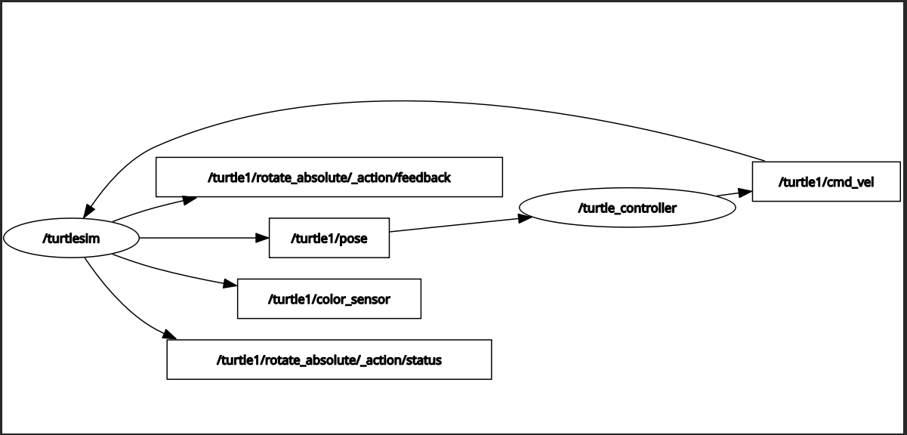
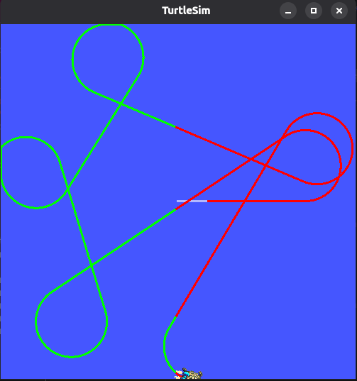
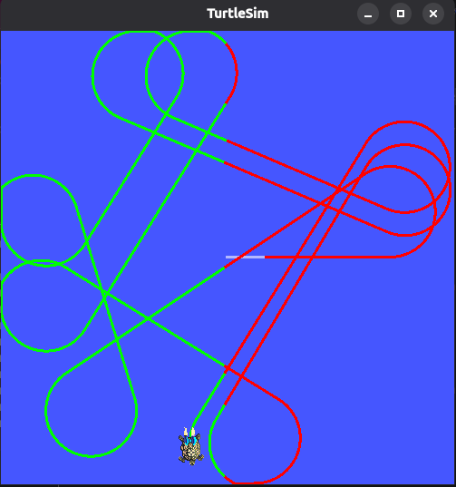

# ROS 2 Learning Journey 

This repository contains my learning and practice work while learning **ROS 2 (Robot Operating System 2)** using Ubuntu and Python.

The goal of this repository is to understand the fundamentals of ROS 2 and gradually build robot-control applications using Nodes, Topics, Services, Publishers, Subscribers, and Actions.

---

##  Environment

* **OS:** Ubuntu
* **ROS 2:** Lyrical
* **Programming Language:** Python
* **Build System:** Colcon
* **Workspace:** `~/ros2_ws`
* **Package:** `my_robot_controller`
* **Simulation:** Turtlesim

---

# What I Have Learned

## 1. ROS 2 Nodes

A **Node** is a program/component that performs a specific task in a ROS 2 system.

For example:

* `/turtlesim` → controls the turtle simulation
* `/turtle_controller` → controls the turtle
* `/pose_subscriber` → receives and displays turtle position

Useful command:

```bash
ros2 node list
```

---

## 2. ROS 2 Topics

A Topic is a communication channel used by Nodes to exchange data.

> Topic is way to communicate between different nodes in ROS application.

Where:

* Nodes are different programs what publish or Subscribe,through Topic.
* One topic can have many publisher and subscriber Nodes.

Topics generally use a **Publisher → Subscriber** communication model.

### Example

```text
turtle_controller

       |
       | publishes Twist
       ↓

/turtle1/cmd_vel

       |
       ↓

turtlesim
```

Useful commands:

```bash
ros2 topic list
```

```bash
ros2 topic info /turtle1/cmd_vel
```

```bash
ros2 topic echo /turtle1/pose
```

---

## 3. Publisher

A Publisher sends messages to a Topic.

Example:

```python
self.cmd_vel_publisher = self.create_publisher(
    Twist,
    "/turtle1/cmd_vel",
    10
)
```

The publisher sends Twist messages to control the turtle.

---

## 4. Subscriber

A Subscriber receives messages from a Topic.

Example:

```python
self.pose_subscriber = self.create_subscription(
    Pose,
    "/turtle1/pose",
    self.pose_callback,
    10
)
```

---

## 5. Messages

A Message is the actual data being transmitted through a Topic.

For example:

`/turtle1/pose`

uses:

```text
turtlesim_msgs/msg/Pose
```

The Pose message contains:

```text
float32 x
float32 y
float32 theta
float32 linear_velocity
float32 angular_velocity
```

---

## 6. Services

A Service provides request/response communication.

Basic structure:

```text
Client
   |
   | Request
   ↓
Server
   |
   | Response
   ↓
Client
```

Services are useful when we want to ask a Node to perform an operation and receive a response.

### Example: Add Two Integers

Service:

```text
/add_two_ints
```

Interface:

```text
int64 a
int64 b
---
int64 sum
```

The part above `---` is the request.

The part below `---` is the response.

Example:

```bash
ros2 service call /add_two_ints example_interfaces/srv/AddTwoInts "{'a':2,'b':57}"
```

Response:

```text
sum=59
```

### Communication

```text
Client
   |
   | a=2, b=57
   ↓
add_two_ints_server
   |
   | 2 + 57
   ↓
Response: 59
```

---

## 7. Service Client

A ROS 2 Node can create a Service Client to communicate with a Service Server.

Example from the Turtle Controller:

```python
client = self.create_client(
    SetPen,
    "/turtle1/set_pen"
)
```

The client can send pen settings such as:

* `r`
* `g`
* `b`
* `width`
* `off`

to the Turtlesim service.

### Common Purposes

**Computation** → Ask the server to calculate/do something and return a result.

Example:

```text
AddTwoInts 2 + 57 → 59
```

**Change of settings/state** → Ask the server to change something.

Example:

```text
turn a motor ON/OFF
change a parameter
reset something
```

**Trigger an operation** → Tell the server to perform an operation and get success/failure.

Example:

```text
/clear in turtlesim → clear the screen
```

---

## 8. Actions

ROS 2 Actions are used for long-running tasks.

Basic structure:

```text
Client
   |
   | Goal
   ↓
Action Server
   |
   | Feedback
   ↓
Client
   |
   | Result
   ↓
Client
```

Actions are useful when an operation takes time and we need feedback while it is running.

---

#  Turtle Controller Project

This project is a Python-based ROS 2 Node that controls a turtle in the Turtlesim simulation.

The `turtle_controller` Node is responsible for:

- Controlling the turtle's movement using the `/turtle1/cmd_vel` topic.
- Receiving the turtle's current position using the `/turtle1/pose` topic.
- Checking whether the turtle is on the left or right side.
- Changing the turtle's pen color using the `/turtle1/set_pen` service depending on its position.

## 🔄 How the Project Works

The turtle continuously moves inside the Turtlesim environment.

The `turtle_controller` receives the turtle's position from:

```text
             Turtle Position
                    |
                    ↓
             Read x position
                    |
             ┌──────┴──────┐
             ↓             ↓
        Right Side      Left Side
             |             |
             ↓             ↓
       Change Pen       Change Pen
          Color             Color
             |             |
             └──────┬──────┘
                    ↓
              Turtle draws

                Pose

         /turtle1/pose

                ↑

                |

          ┌───────────┐
          │  Turtlesim │
          │            │
          │          │
          └─────┬─────┘

                ↑

                |

          /turtle1/cmd_vel

                ↑

                |

      ┌──────────────────┐
      │ turtle_controller│
      └───────┬─────┬────┘
              │     │
      Twist   │     │ SetPen Service
              ↓     ↓
    /turtle1/cmd_vel

                     /turtle1/set_pen
```

This makes the README much clearer because someone visiting your GitHub can immediately understand:

**“What did this person actually build?”**

→ A ROS 2 turtle controller  
→ Turtle movement is controlled  
→ Position is received  
→ Left/right position is detected  
→ Pen color changes accordingly  
→ The turtle draws in Turtlesim  
→ RQT Graph shows the ROS communication.
---
# 📸 Project Demo

## RQT Graph



## Turtlesim Running



## Turtle Controller



#  Complete Communication Flow

```text
                     ┌─────────────────┐
                     │    Turtlesim    │
                     │                 │
                     │               │
                     └───────┬─────────┘
                             │
                             │ Pose
                             ↓
                     /turtle1/pose
                             │
                             ↓
                ┌────────────────────────┐
                │   turtle_controller    │
                │                        │
                │  • Reads position      │
                │  • Controls movement   │
                │  • Detects crossing    │
                └───────┬─────────┬──────┘
                        │         │
                        │         │ Service Request
                        │         ↓
                        │   /turtle1/set_pen
                        │
                        ↓
                /turtle1/cmd_vel
                        │
                        ↓
                     Turtlesim
```

---

#  Useful ROS 2 Commands Learned

## Check Nodes

```bash
ros2 node list
```

## Get Node Information

```bash
ros2 node info /turtle_controller
```

## Check Topics

```bash
ros2 topic list
```

## View Topic Data

```bash
ros2 topic echo /turtle1/pose
```

## Check Services

```bash
ros2 service list
```

## Check Service Type

```bash
ros2 service type /add_two_ints
```

## Inspect an Interface

```bash
ros2 interface show example_interfaces/srv/AddTwoInts
```

## Check Package Executables

```bash
ros2 pkg executables my_robot_controller
```

## Build Workspace

```bash
colcon build --symlink-install
```

## Source Workspace

```bash
source install/setup.bash
```

## Run a Node

```bash
ros2 run my_robot_controller turtle_controller
```

## Open ROS Graph

```bash
ros2 run rqt_graph rqt_graph
```
